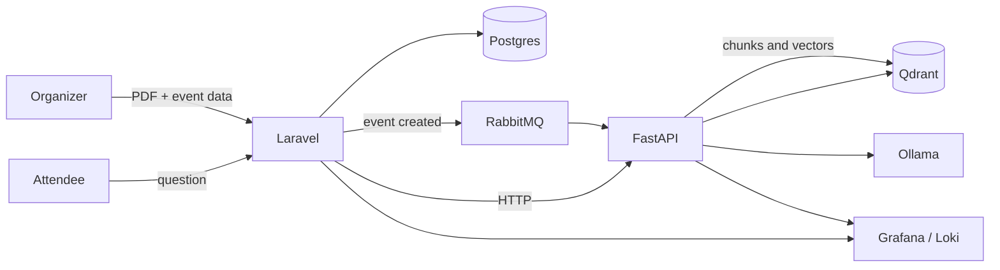

# VectaPass

[Português](README.md) · **English**


Event SaaS where the organizer's rules PDF becomes the source of answers for attendees. Laravel owns the domain: event, ticket, price, and date. A Python service runs the RAG pipeline: it splits the document, stores vectors in Qdrant, and answers with Ollama. Indexing the PDF is asynchronous, through RabbitMQ. Answering a question is synchronous HTTP, because someone is waiting on the screen.

The repository is in development. Local infrastructure and the event domain core are in place. The AI engine, messaging between the two services, and the chat are still in scope.

## Architecture



Creating an event stores the aggregate and publishes a message. Python consumes that message, splits the PDF with LangChain, and writes the vectors. Chat skips the queue: Laravel receives the question, calls Python, and Python searches Qdrant before querying Ollama.

Ollama runs on the host, outside Compose. The model needs the host CPU or GPU. The rest of the stack runs in containers on the same network.

## Boundaries

The domain lives in `laravel-app/app/Domain` as plain PHP. `Event` is a standalone class. Eloquent, HTTP, and persistence live in `Infrastructure`. The use case in `Application` depends on `EventRepositoryInterface`, and the concrete binding is registered in the container.

Python reads the message, handles the file, and writes only to Qdrant. Prompt, chunking, and the Ollama client live in the Python service.

## Scope

| | Area | Delivery | Status |
| --- | --- | --- | --- |
| TSK-001 | Infrastructure | Compose with Postgres, RabbitMQ, Qdrant, Loki, Grafana, and Alloy on the `vectapass` network | ![Live][live] |
| TSK-002 | Domain | `Event`, `EventDate`, and `Price` in plain PHP. `Ticket` is still to come | ![In progress][in-progress] |
| TSK-003 | Application | `CreateEventUseCase` persists through a repository interface. The PDF is still a path, with no file pipeline | ![In progress][in-progress] |
| TSK-004 | Python | FastAPI with `/health` and a client for local Ollama | ![Planned][planned] |
| TSK-005 | Messaging | Laravel publishes to RabbitMQ and Python consumes in the background | ![Planned][planned] |
| TSK-006 | RAG | LangChain splits the PDF and persists vectors in Qdrant | ![Planned][planned] |
| TSK-007 | Chat | Laravel forwards the question; Python queries Qdrant and Ollama | ![Planned][planned] |
| TSK-008 | Observability | Alloy already ships container logs to Loki. JSON emitted by PHP and Python is still missing | ![In progress][in-progress] |
| TSK-009 | Tests | Pest covers `Event`, `EventDate`, `Price`, and the repository. The Python chunking test is still missing | ![In progress][in-progress] |

[live]: https://img.shields.io/badge/live-15803d?style=flat-square
[in-progress]: https://img.shields.io/badge/in%20progress-d97706?style=flat-square
[planned]: https://img.shields.io/badge/planned-64748b?style=flat-square

## Local environment

```bash
docker compose up -d
```

| Service | Port | Use |
| --- | --- | --- |
| Postgres 16 | `127.0.0.1:5432` | Relational database. User, password, and database `vectapass` |
| RabbitMQ | `5672` and management UI on `15672` | AMQP and management. User and password `vectapass` |
| Qdrant | `6333` REST, `6334` gRPC | RAG vectors |
| Loki | `3100` | Log aggregation |
| Grafana | `3000` | Log search. `admin` / `admin`, with Loki already provisioned |
| Alloy | `12345` | Collects logs from containers in this stack |

Those credentials are the local Compose defaults. Override them with environment variables (`POSTGRES_USER`, `RABBITMQ_USER`, `GRAFANA_ADMIN_PASSWORD`, and others) before `up`.

Laravel in `laravel-app` still points at SQLite in `.env.example`. Compose Postgres is the database for the integrated environment.

```bash
cd laravel-app
composer install
cp .env.example .env
php artisan key:generate
php artisan migrate
php artisan test --compact
```

## Layout

```text
vectapass/
├── docker-compose.yml
└── laravel-app/
    └── app/
        ├── Domain/          # entities, value objects, contracts
        ├── Application/     # use cases
        └── Infrastructure/  # Eloquent, HTTP, concrete repositories
```

The Python service lands at the repository root when TSK-004 starts. It talks to Laravel over the `vectapass` network.
