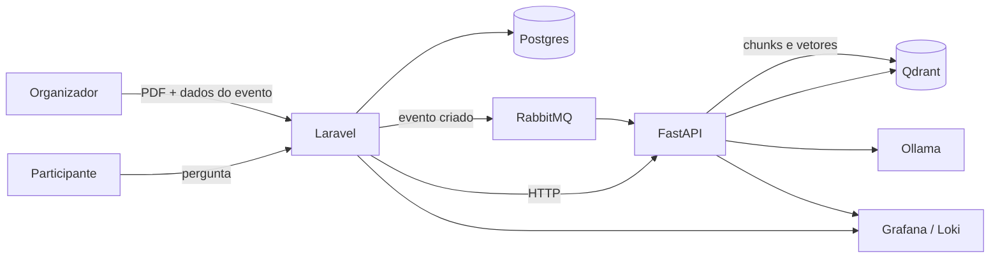

# VectaPass


SaaS de eventos em que o PDF de regras do organizador vira a fonte das respostas ao participante. O Laravel é o dono do domínio: evento, ingresso, preço e data. Um serviço Python faz o RAG: fatia o documento, persiste os vetores no Qdrant e responde com o Ollama. Indexar o PDF é assíncrono, via RabbitMQ. Responder uma pergunta é síncrono, via HTTP, porque tem alguém esperando na tela.

O repositório está em desenvolvimento. A infraestrutura local e o núcleo de domínio do evento já existem. O motor de IA, a mensageria entre os dois serviços e o chat ainda são escopo.

## Arquitetura



A criação do evento grava o agregado e publica uma mensagem. O Python consome essa mensagem, quebra o PDF com LangChain e grava os vetores. O chat não passa pela fila: o Laravel recebe a pergunta, chama o Python, e o Python busca no Qdrant antes de consultar o Ollama.

Ollama roda na máquina, fora do Compose. O modelo precisa da CPU ou da GPU do host; o restante da stack sobe em container, na mesma rede.

## Limites

O domínio fica em `laravel-app/app/Domain` e é PHP puro. `Event` não estende Model. Eloquent, HTTP e persistência ficam em `Infrastructure`. O caso de uso em `Application` depende de `EventRepositoryInterface`, e o binding concreto é feito no container.

O Python não escreve na tabela de eventos. Ele lê a mensagem, trata o arquivo e escreve só no Qdrant. O Laravel não embute prompt, chunking nem cliente do Ollama.

## Escopo

| | Área | Entrega | Estado |
| --- | --- | --- | --- |
| TSK-001 | Infraestrutura | Compose com Postgres, RabbitMQ, Qdrant, Loki, Grafana e Alloy na rede `vectapass` | ![No ar][no-ar] |
| TSK-002 | Domínio | `Event`, `EventDate` e `Price` em PHP puro. `Ticket` ainda entra | ![Em progresso][em-progresso] |
| TSK-003 | Aplicação | `CreateEventUseCase` persiste pela interface de repositório. O PDF ainda é um caminho, sem pipeline de arquivo | ![Em progresso][em-progresso] |
| TSK-004 | Python | FastAPI com `/health` e cliente do Ollama local | ![Previsto][previsto] |
| TSK-005 | Mensageria | Laravel publica no RabbitMQ e o Python consome em background | ![Previsto][previsto] |
| TSK-006 | RAG | LangChain fatia o PDF e persiste os vetores no Qdrant | ![Previsto][previsto] |
| TSK-007 | Chat | Laravel encaminha a pergunta; Python consulta Qdrant e Ollama | ![Previsto][previsto] |
| TSK-008 | Observabilidade | Alloy já coleta log dos containers para o Loki. Falta o JSON emitido por PHP e Python | ![Em progresso][em-progresso] |
| TSK-009 | Testes | Pest cobre `Event`, `EventDate`, `Price` e o repositório. Falta o teste de fatiamento no Python | ![Em progresso][em-progresso] |

[no-ar]: https://img.shields.io/badge/no%20ar-15803d?style=flat-square
[em-progresso]: https://img.shields.io/badge/em%20progresso-d97706?style=flat-square
[previsto]: https://img.shields.io/badge/previsto-64748b?style=flat-square

## Ambiente local

```bash
docker compose up -d
```

| Serviço | Porta | Uso |
| --- | --- | --- |
| Postgres 16 | `127.0.0.1:5432` | Banco relacional. Usuário, senha e database `vectapass` |
| RabbitMQ | `5672` e painel em `15672` | AMQP e management. Usuário e senha `vectapass` |
| Qdrant | `6333` REST, `6334` gRPC | Vetores do RAG |
| Loki | `3100` | Agregação de logs |
| Grafana | `3000` | Busca de logs. `admin` / `admin`, com o Loki já provisionado |
| Alloy | `12345` | Coleta o log dos containers desta stack |

As credenciais acima são o padrão local do Compose. Dá para trocar com variáveis de ambiente (`POSTGRES_USER`, `RABBITMQ_USER`, `GRAFANA_ADMIN_PASSWORD`, entre outras) antes do `up`.

O Laravel em `laravel-app` ainda aponta para SQLite no `.env.example`. O Postgres do Compose é o banco do ambiente integrado, não o default atual da aplicação.

```bash
cd laravel-app
composer install
cp .env.example .env
php artisan key:generate
php artisan migrate
php artisan test --compact
```

## Layout

```text
vectapass/
├── docker-compose.yml
└── laravel-app/
    └── app/
        ├── Domain/          # entidades, value objects, contratos
        ├── Application/     # use cases
        └── Infrastructure/  # Eloquent, HTTP, repositórios concretos
```

O serviço Python entra na raiz quando o TSK-004 começar. Ele conversa com o Laravel pela rede `vectapass`, não por import compartilhado.
